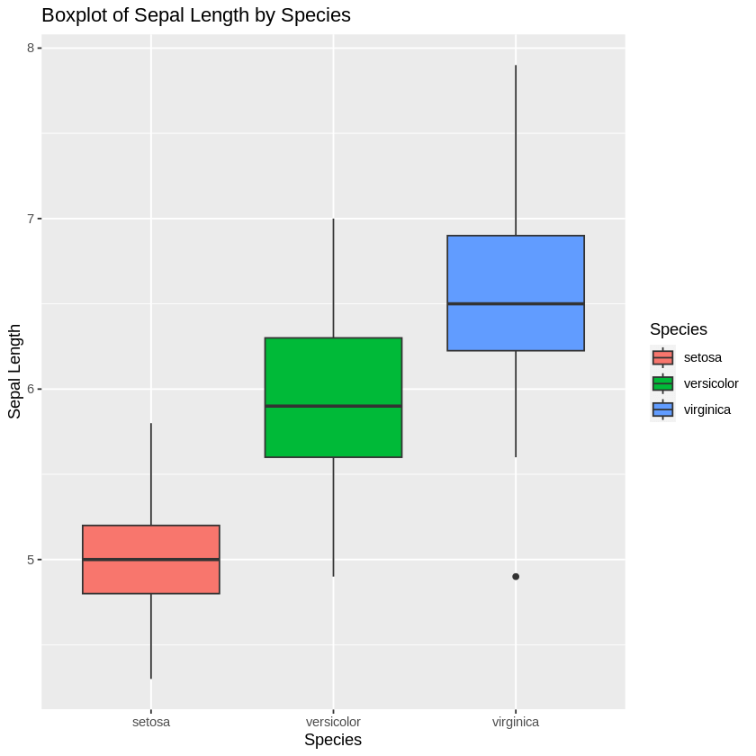

# Iris-Data-Analysis / Iris Veri Analizi

This project provides a basic statistical analysis and visualization of the famous `iris` dataset using R. The `iris` dataset contains measurements of three iris species: setosa, versicolor, and virginica.🌼

Bu proje, ünlü `iris` veri setinin R kullanarak temel istatistiksel analizini ve görselleştirmesini sağlar. `iris` veri seti, üç iris türünün (setosa, versicolor, virginica) ölçümlerini içerir.🌼

## Important Note / Önemli Not 😊

**Although the code is saved in a `.py` file, it is written in R language. Please run it in an R environment.**

**Kod `.py` dosyasında kaydedilmiş olmasına rağmen, R dilinde yazılmıştır. Lütfen bir R ortamında çalıştırın.**

# Example Output / Örnek Çıktı

Sepal Length Mean: 5.843333 

Sepal Length Median: 5.8 

Sepal Length Standard Deviation: 0.8280661 

Setosa Sepal Length Mean: 5.006 

Versicolor Sepal Length Mean: 5.936 

Virginica Sepal Length Mean: 6.588

